# Scalable Stock Return Prediction System

### End-to-End Financial Return Prediction using Machine Learning, Hadoop & PySpark

---

## Live Demo

**Interactive Streamlit Application:**  
**https://stock-return-prediction-model.streamlit.app/**

> Predict future stock returns using financial statement metrics through an interactive web application.

---

## Table of Contents

- [Overview](#overview)
- [Problem Statement](#problem-statement)
- [Dataset](#dataset)
- [Target Variable](#target-variable)
- [System Architecture](#system-architecture)
- [Technology Stack](#technology-stack)
- [Machine Learning Pipeline (V1)](#machine-learning-pipeline-v1)
- [Big Data Scaling Extension (V2)](#big-data-scaling-extension-v2)
- [Model Performance](#model-performance)
- [Project Highlights](#project-highlights)
- [Project Gallery](#project-gallery)
- [Repository Structure](#repository-structure)
- [Key Learnings](#key-learnings)

---

# Overview

Financial markets generate enormous volumes of structured data every day, making traditional manual analysis increasingly difficult. This project builds an end-to-end machine learning pipeline that predicts future stock returns using company financial statements, valuation ratios, profitability metrics, ownership patterns, and historical market prices.

The project was developed in two stages:

**Version 1 – Machine Learning Pipeline**

An end-to-end predictive analytics system built using Scikit-Learn and CatBoost with deployment through an interactive Streamlit application.

**Version 2 – Big Data Scaling Extension**

The same workflow was scaled using Hadoop HDFS and Apache Spark to process a synthetic dataset containing over **500,000 financial records**, demonstrating distributed preprocessing, model inference, and scalable machine learning.

---

# Problem Statement

Traditional stock analysis requires evaluating dozens of financial indicators across thousands of companies.

The objective of this project is to automate this process by building machine learning models capable of estimating future stock returns while demonstrating how such systems can be scaled for large datasets using distributed computing technologies.

---

# Dataset

The final dataset was created by combining multiple financial data sources including:

- Balance Sheets
- Profit & Loss Statements
- Cash Flow Statements
- Financial Ratios
- Ownership Metrics
- Historical Market Prices

### Final Dataset

- 90+ financial features
- Multiple years of company fundamentals
- Historical stock prices
- Financial valuation metrics
- Ownership information

---

# Target Variable

```python
future_return = (future_price - current_price) / current_price
```

The regression models predict the future percentage return of a stock based on historical financial information.

---

# System Architecture


---

# Technology Stack

| Category | Technologies |
|-----------|--------------|
| Programming | Python, SQL |
| Data Processing | Pandas, NumPy, PySpark |
| Machine Learning | Scikit-Learn, CatBoost, Spark MLlib |
| Big Data | Hadoop HDFS, Apache Spark |
| Visualization | Matplotlib, Seaborn |
| Deployment | Streamlit |
| Version Control | Git, GitHub |

---

# Machine Learning Pipeline (V1)

### Workflow

```
Raw Financial Data
        │
        ▼
Data Cleaning
        │
        ▼
EDA
        │
        ▼
Feature Engineering
        │
        ▼
Feature Selection
        │
        ▼
Model Training
        │
        ▼
Hyperparameter Tuning
        │
        ▼
Model Evaluation
        │
        ▼
Streamlit Deployment
```

---

### Models Evaluated

- Linear Regression
- K-Nearest Neighbors
- Random Forest
- Extra Trees
- XGBoost
- CatBoost

CatBoost Regressor achieved the best overall performance and was selected as the production model.

### Live Inference

The trained CatBoost model is deployed using **Streamlit**, allowing users to enter financial metrics and obtain predicted future stock returns through an interactive web interface.

**Live Demo:** https://stock-return-prediction-model.streamlit.app/

---

# Big Data Scaling Extension (V2)

To demonstrate scalability, the complete workflow was extended using Hadoop and Apache Spark.

### Big Data Pipeline

```
Synthetic Dataset (500K Rows)
            │
            ▼
      Hadoop HDFS
            │
            ▼
     PySpark DataFrames
            │
            ▼
 Missing Value Imputation
            │
            ▼
 Feature Encoding
            │
            ▼
 Feature Scaling
            │
            ▼
 Vector Assembly
            │
            ▼
 Spark Random Forest
            │
            ▼
 Distributed Predictions
```

### Big Data Components

- Generated a synthetic dataset containing **500,000 rows**
- Stored datasets in Hadoop Distributed File System (HDFS)
- Built preprocessing using Spark ML Pipelines
- Saved reusable Spark preprocessing models
- Performed distributed batch inference using Spark Random Forest

---

# V1 vs V2

| Feature | Version 1 | Version 2 |
|----------|-----------|-----------|
| Framework | Scikit-Learn | Spark ML |
| Data Processing | Pandas | PySpark |
| Storage | Local CSV | Hadoop HDFS |
| Dataset Size | Original Dataset | 500K Records |
| Deployment | Streamlit | Distributed Batch Inference |
| Goal | Predictive Analytics | Scalability |

---

# Model Performance

## Machine Learning Model

| Metric | Score |
|---------|-------|
| Best Model | CatBoost Regressor |
| R² Score | **0.3815** |
| MAE | **0.0446** |
| RMSE | **0.0566** |

---

## Big Data Pipeline

| Component | Result |
|-----------|--------|
| Dataset Size | 500,000 Rows |
| Storage | Hadoop HDFS |
| Processing | Apache Spark |
| ML Library | Spark MLlib |
| Output | Distributed Predictions |

---

# Project Highlights

- Built an end-to-end financial return prediction system.
- Engineered over **90 financial features** from multiple financial datasets.
- Compared six regression algorithms for predictive performance.
- Selected CatBoost as the best-performing model.
- Developed a Streamlit application for interactive prediction.
- Generated a synthetic dataset containing over **500,000 records**.
- Built a distributed Spark ML pipeline.
- Stored datasets in Hadoop Distributed File System.
- Performed distributed preprocessing and batch inference.

---

# Project Gallery

## Version 1 – Machine Learning Pipeline

| Dataset Overview | Exploratory Data Analysis |
|-----------------|---------------------------|
| 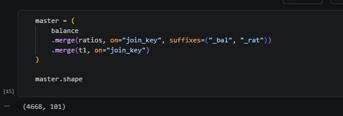 | 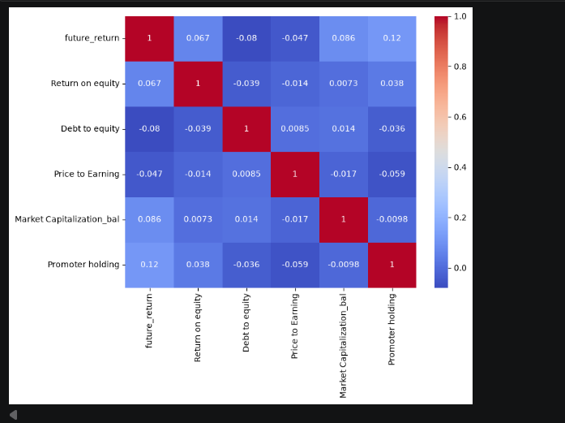 |

| Feature Engineering | Top Features |
|--------------------|--------------|
| 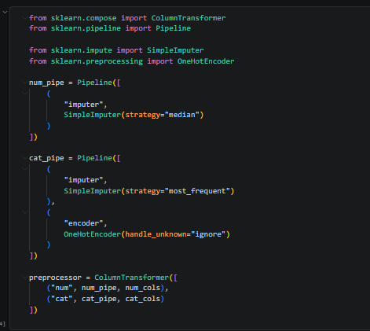 |  |

| Feature Importance | Cross Validation |
|-------------------|------------------|
| 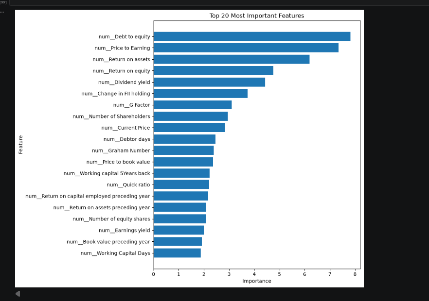 | 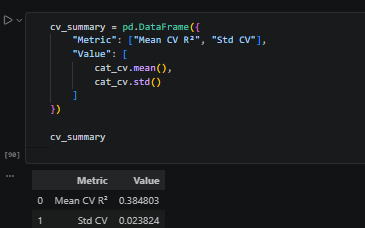 |

| Model Comparison | Streamlit Dashboard |
|-----------------|---------------------|
| 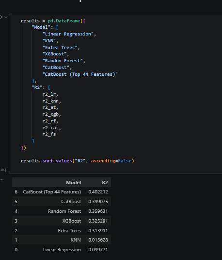 | 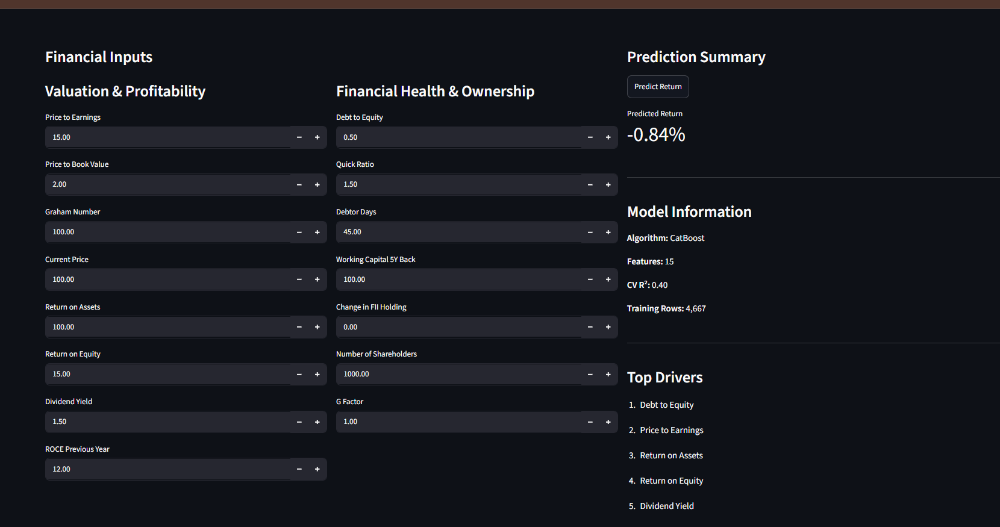 |

---

## Version 2 – Big Data Scaling

| Synthetic Dataset | Spark Project Structure |
|------------------|-------------------------|
| 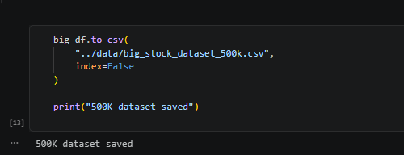 | 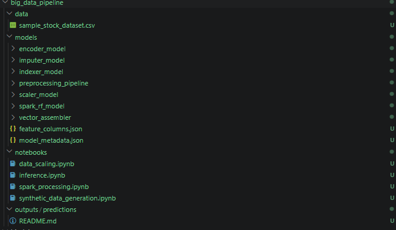 |

| Spark Data Processing | Spark ML Pipeline |
|----------------------|-------------------|
| 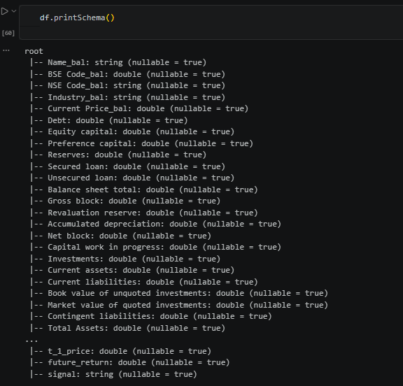 | 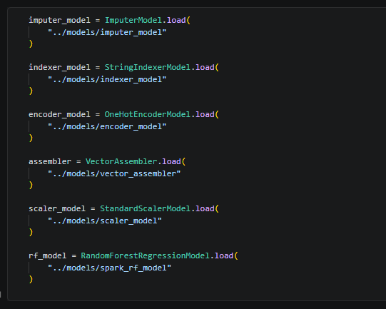 |

| Distributed Predictions |
|-------------------------|
| 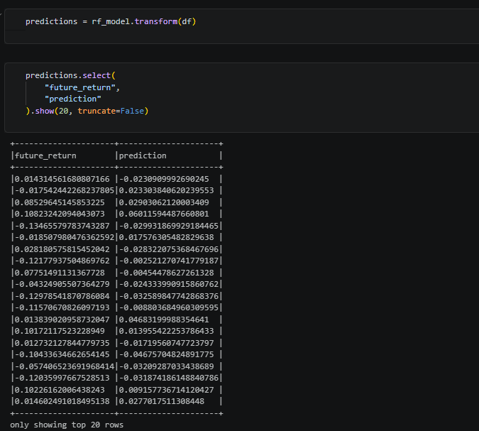 |

---

# Repository Structure

```text
finance_project/
│
├── app/
│   └── app.py
│
├── data/
│
├── notebooks/
│   ├── understanding_data.ipynb
│   ├── eda.ipynb
│   └── feature_engineering_2.ipynb
│
├── models/
│   ├── stock_return_model.pkl
│   └── stock_return_app_model.pkl
│
├── big_data_extension/
│   ├── data/
│   ├── models/
│   ├── notebooks/
│   ├── outputs/
│   └── predictions/
│
├── images/
│   ├── v1/
│   └── v2/
│
├── requirements.txt
└── README.md
```

---

# Key Learnings

This project demonstrates the complete lifecycle of a predictive analytics system—from financial data preparation and machine learning model development to distributed data engineering using Hadoop and Apache Spark.

Key takeaways include:

- Building production-ready regression pipelines.
- Engineering financial features from structured datasets.
- Comparing multiple machine learning algorithms.
- Deploying predictive models through Streamlit.
- Scaling workflows using Hadoop HDFS.
- Building Spark ML pipelines for distributed processing.
- Transitioning from traditional machine learning to scalable big data engineering.